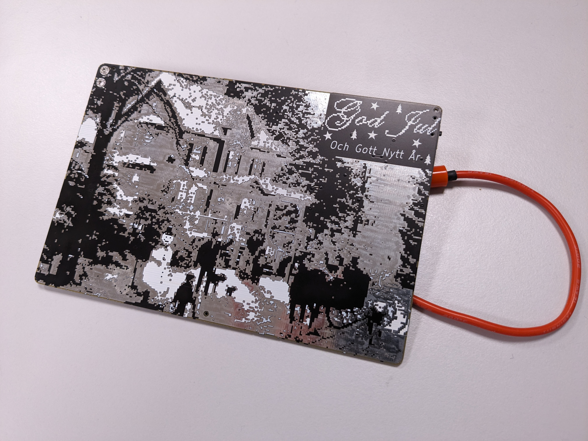

# Christmas banana synth - Christmas card for 2022

The Christmas banana synth is a stylophone synthesizer with 24 keys and a buzzer for sound. The back features PCB art of a winter landscape. There are also 12 built-in songs available. We used assembly of components by JLCPCB to speed up the process, since we made around 25 boards.

## Video sample (Turn on sound)

https://github.com/adaand00/christmas-banana-synth/assets/45564940/3717fd15-4f71-4382-aa24-0abd6eaa9e98

Credit to Johan (@johanwheeler) for the playing.

## Images

